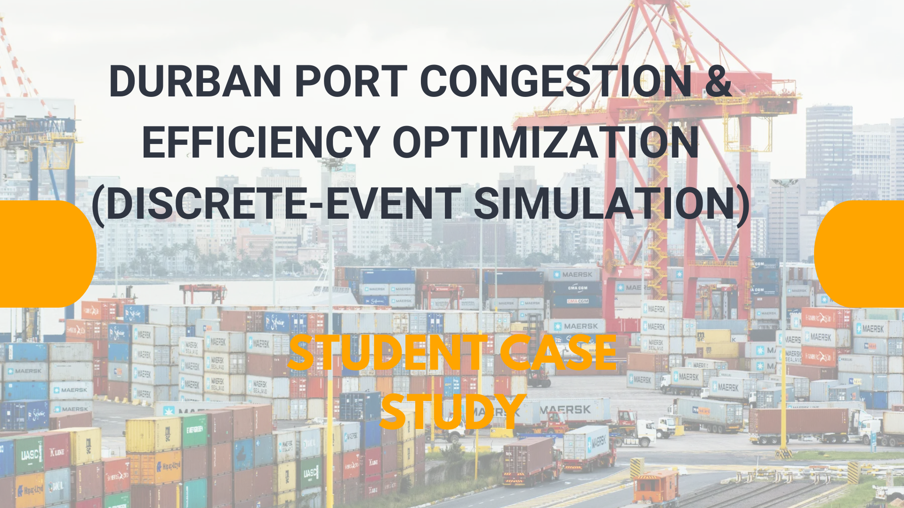
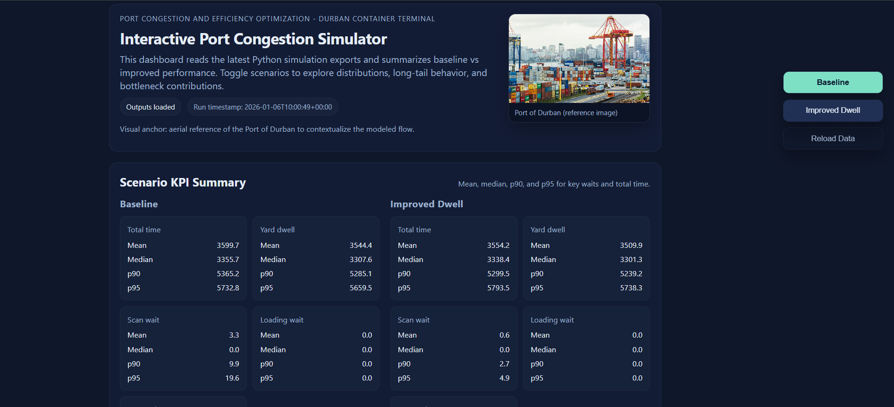
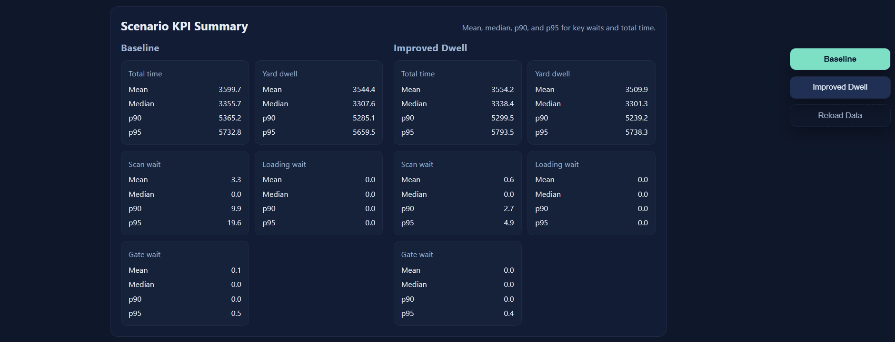
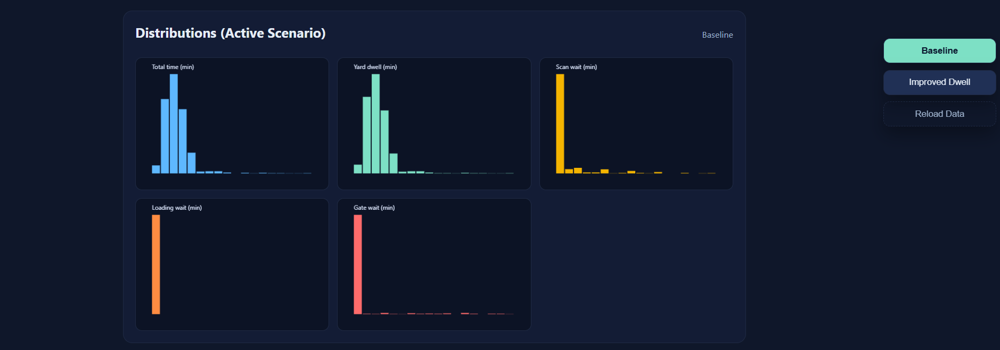
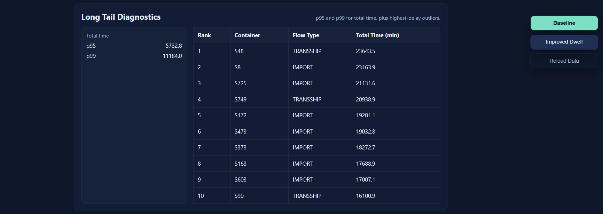
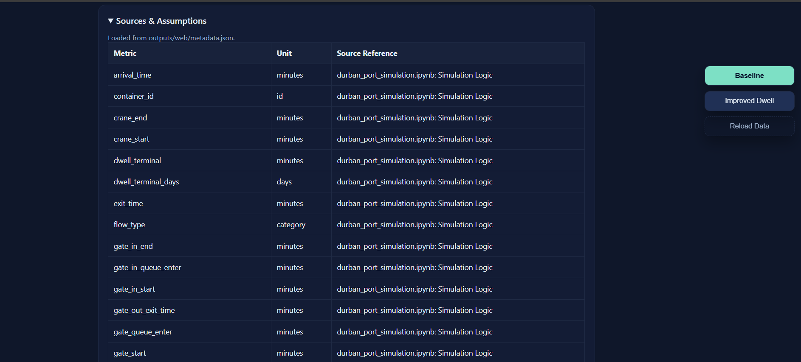

# Durban Port Congestion & Efficiency Optimization (SimPy)




This repo models container congestion at the Port of Durban using a SimPy
discrete-event simulation. The main notebook compares baseline operations
against improved dwell strategies and can optionally run a vessel/berth layer
with crane assignment (gang intensity).

This is a student/analytical model only. It is not an official Transnet model
and should not be treated as an endorsement or operational system.

## What this project contains

- End-to-end SimPy model of container flow: discharge, yard, scan, load, gate.
- Flow types: IMPORT, EXPORT, TRANSSHIP (split by entry source).
- Shift-calendar gating for crane and yard-equipment downtime.
- Optional vessel/berth layer with berth queues, crane pools, and discharge
  rate based on GCH productivity.
- Truck Appointment System (TAS) module for truck arrivals and slotting.
- Data ingestion scripts for unit volume Excel reports and KPI tables from PDFs.

## Project structure

- durban_port_simulation.ipynb - primary notebook (baseline + improved runs,
  metrics, plots, validation).
- vessel_layer.py - vessel/berth + crane assignment layer (toggle-driven).
- vessel_params.py - vessel-layer parameters with SOURCE-ANCHORED vs
  ASSUMPTION tags.
- VESSEL_LAYER_NOTES.md - short notes on the vessel layer, toggles, and
  assumptions.
- truck_tas.py - Truck Appointment System (TAS) arrivals + truck process.
- scripts/ingest/ingest_unit_volume_reports.py - Excel unit volume ingestion.
- scripts/ingest/ingest_port_terminals_kpis.py - PDF KPI extraction pipeline.
- data/processed/unit_volume/ - cleaned unit-volume outputs + dictionary/log.
- data/processed/port_terminals_kpis/ - KPI extraction outputs + log.
- simulation/interactive_port_congestion_simulator/ - optional UI prototype.
- figures/ - saved plots per run under run_YYYYMMDD_HHMMSS/.

## Interactive simulator (visuals)

The interactive dashboard lives in `simulation/interactive_port_congestion_simulator/`.
Use it to explore baseline vs improved performance after exporting web outputs.
Detailed run instructions are in `simulation/interactive_port_congestion_simulator/README.md`.








## Dependencies

Minimum for the notebook:
```bash
python -m pip install simpy pandas numpy matplotlib seaborn
```

Optional data pipeline dependencies:
```bash
python -m pip install openpyxl xlrd pyyaml pyarrow pdfplumber
```

## Data pipelines

### Unit volume ingestion (Excel)
Converts monthly unit-volume Excel reports into a unified dataset used by the
truck arrival profile in the simulation.
```bash
python scripts/ingest/ingest_unit_volume_reports.py
```
Outputs are written to data/processed/unit_volume/ (CSV, parquet, dictionary,
and ingestion_log.json).

### Port terminals KPI ingestion (PDF)
Extracts KPI tables from annual PDF reports into a tidy dataset:
```bash
python scripts/ingest/ingest_port_terminals_kpis.py
```
Outputs are written to data/processed/port_terminals_kpis/.

## How to run the simulation

## Quickstart

Minimal path to get a baseline run and plots:
1. Open durban_port_simulation.ipynb.
2. Keep USE_VESSEL_LAYER = False for the default direct-arrivals mode.
3. Run all cells top-to-bottom.
4. Check figures/ for the latest run_YYYYMMDD_HHMMSS/ output folder.

1. Open durban_port_simulation.ipynb.
2. Run cells top-to-bottom.
3. Key toggles live in the Global Parameters cell:
   - USE_VESSEL_LAYER: switch between direct container arrivals and vessel-
     driven batch arrivals.
   - ENABLE_ANCHORAGE_QUEUE, INCLUDE_MARINE_DELAYS: vessel-layer options.
   - P_IMPORT, P_EXPORT, P_TRANSSHIP: flow mix probabilities.
   - Shift calendar parameters (e.g., SHIFT_LENGTH_MINS) affect crane/yard
     downtime.
4. Plots are saved under figures/run_.../ and displayed inline.

### Baseline vs improved runs
The notebook runs:
- Baseline (current dwell + resources).
- Improved dwell (alternative dwell assumptions + aligned shifts).
Both produce DataFrames and comparison plots.

### TAS (Truck Appointment System)
Run the Truck + TAS Simulation (Phase 2) section in the notebook to
simulate truck slotting, staging waits, and terminal TTT (turnaround time).

## Outputs and KPIs

Key DataFrames created in the notebook:
- df / df_improved: container metrics (arrival, yard entry/exit, scan/load
  queues, gate events, etc.).
- df_trucks: truck metrics (turnaround, gate waits, loading waits).
- df_vessels_base / df_vessels_improved: vessel metrics (berth waits,
  cranes assigned, discharge times).

Common KPI columns:
- total_time, yard_dwell, dwell_terminal
- scan_wait, loading_wait, gate_wait
- yard_equipment_wait
- pre_pickup_wait, customs_hold_delay, rebook_delay

## Data availability (expected outputs)

File | Producer | Notes
--- | --- | ---
data/processed/unit_volume/unit_volume_long.csv | scripts/ingest/ingest_unit_volume_reports.py | Used for truck arrival profile
data/processed/unit_volume/unit_volume_wide.csv | scripts/ingest/ingest_unit_volume_reports.py | Optional monthly totals
data/processed/unit_volume/unit_volume.parquet | scripts/ingest/ingest_unit_volume_reports.py | Optional parquet output
data/processed/unit_volume/data_dictionary.md | scripts/ingest/ingest_unit_volume_reports.py | Column dictionary
data/processed/unit_volume/ingestion_log.json | scripts/ingest/ingest_unit_volume_reports.py | File-by-file ingest log
data/processed/port_terminals_kpis/port_terminals_kpis_long.csv | scripts/ingest/ingest_port_terminals_kpis.py | KPI long format
data/processed/port_terminals_kpis/cleaned_port_terminals_kpis_long.csv | manual/cleaning | Optional cleaned KPI output
data/processed/port_terminals_kpis/ingestion_log.json | scripts/ingest/ingest_port_terminals_kpis.py | KPI ingest log

## Modeling notes and assumptions

- SOURCE-ANCHORED vs ASSUMPTION tags are called out in
  durban_port_simulation.ipynb and vessel_params.py.
- If unit-volume data is missing, the truck arrival profile falls back to a
  synthetic hourly shape (TRUCK_TEU_BASE_RATE).
- Vessel layer uses a TEU-per-move conversion factor until the unit-volume data
  is fully cleaned.

## Troubleshooting

- If Excel ingestion fails, install openpyxl or xlrd.
- If parquet writes fail, install pyarrow.
- If KPI PDF extraction fails, install pdfplumber (or camelot-py as fallback).
- If truck arrivals look flat, verify
  data/processed/unit_volume/unit_volume_long.csv exists and update
  TRUCK_ARRIVAL_DATA_PATH in the notebook.
