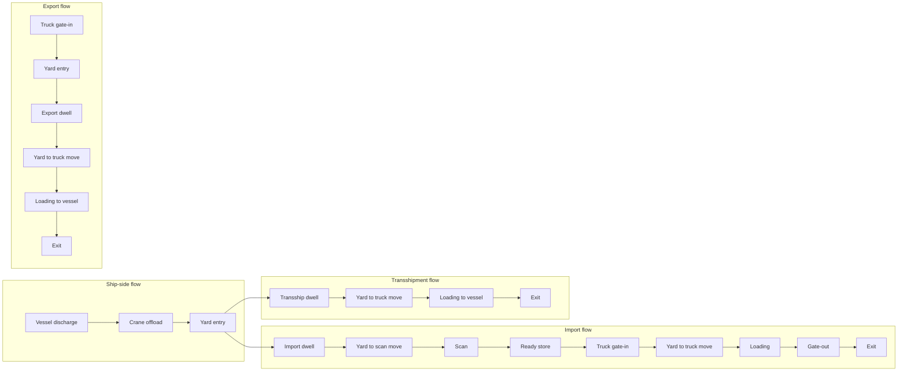
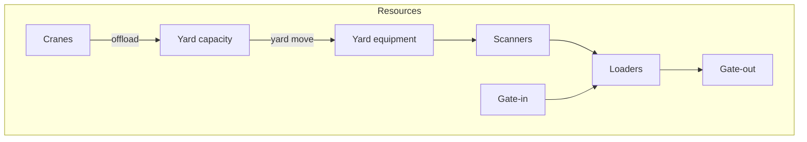
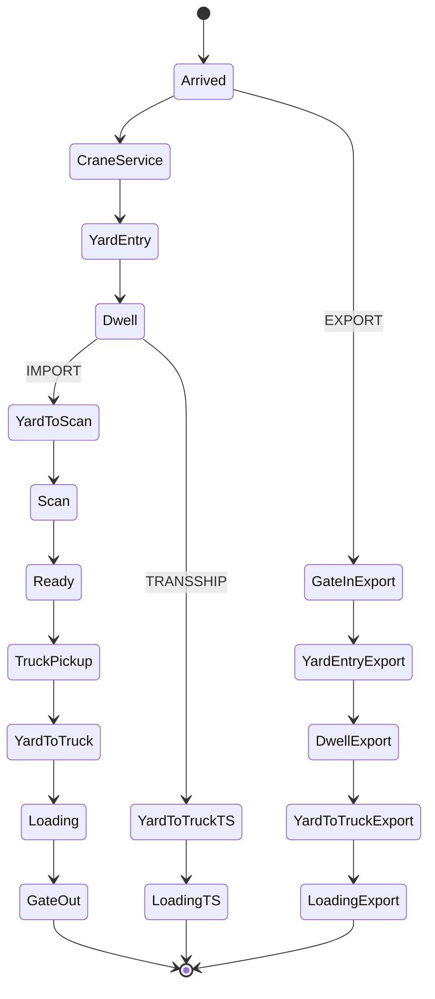
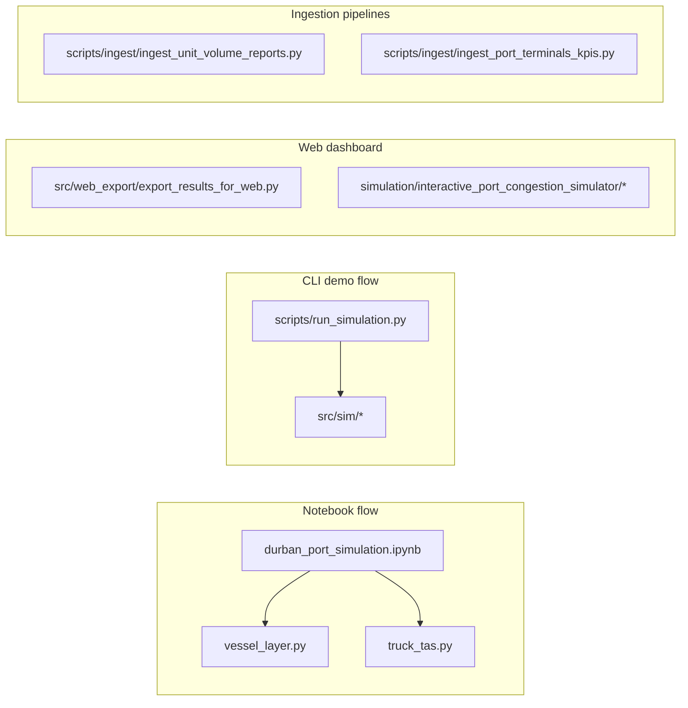

# Architecture Overview

This document describes the implemented simulation flow and how the repo is organized for reviewers.

## System flow (import, export, transshipment)

## Resource and queue map

## Container lifecycle state machine

## Module map

Notes:

- The CLI demo (`scripts/run_simulation.py`) uses the lightweight model in `src/sim/` and does not depend on large datasets.
- The notebook retains the full exploratory workflow and produces the richer plots under `figures/`.
